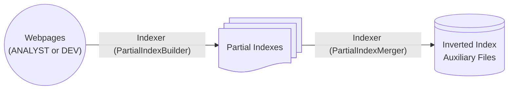

# Search Engine

See `TODO.md` for things that mut still be done.

## Getting started

Install dependencies with `python -m pip install -r requirements.txt`, or however else your environment needs to be set up. `python -m venv .venv` might work, selecting it as your virtual environment, then activating, or however. See <https://docs.python.org/3/library/venv.html#creating-virtual-environments>.

If on Windows, check `config.toml` and run `python main.py` or `python -m unittests discover ./unittest`

If on Linux, config variables are exported as environment variables. Run `./launch.sh` or `./test.sh`. This assumes your virtual environment is stored in .venv of the CWD.

## High level overview

Program starts at `main.py`, where it creates an `Indexer` instance and runs `.construct()`, which constructs the inverted index. From then, the class `InvertedIndex` can be used to interface with the serialized disk data that is the inverted index.

The `Indexer` works by processing webpages to construct several `PartialIndex`es, which are map containers for `Term`s to `PostingList`s, which are themselves are containers for `Posting`s. The `PartialIndex`es are serialized and stored in a directory temporarily, then merged all together with polyphase merge to produce the file for the inverted index, along with auxiliary data files.

The `InvertedIndex` is created as a interface for the inverted index disk data. nothing more. `InvertedIndex` will be used to query the data, but not modify it.

## Configuration

`config.toml` stores key configurations as to where to search or place files.

Webpages are stored in `WEBPAGES_DIR`, Partial indexes are stored in `PARTIAL_INDEX_DIR`, and inverted indexes and it's auxiliary files are stored in `INDEX_DIR`.

## Index Creation

### Index Creation Graph

A graph of the process looks something like this:

### Serialization

Everything from `PartialIndex` down has a `serialize()` method that serializes it in binary. Utilizes Python's `struct` library's `.pack()`, some string encoding, and then deserialization involves `struct` library's `.unpack()` and some manual parsing.

## Index Querying

Has not yet been implemented. All querying will be done with the `InvertedIndex` object, which provides an interface for code to interact with the inverted index on disk.

## Directory `utils`

### config.py

Exports `load_config`, which loads in config settings from config.toml

### logger.py

Exports `index_log` and `engine_log`, which are used to log important information in respective .log files.

### tokenize.py

Exports `get_postings`, which returns a mapping of terms to posting lists to be stored in the inverted index.

## Unit testing

To run unit testing, run `python -m unittests discover ./unittest`. Not required to write unit tests, I just write them because it makes it easier in the long run.
